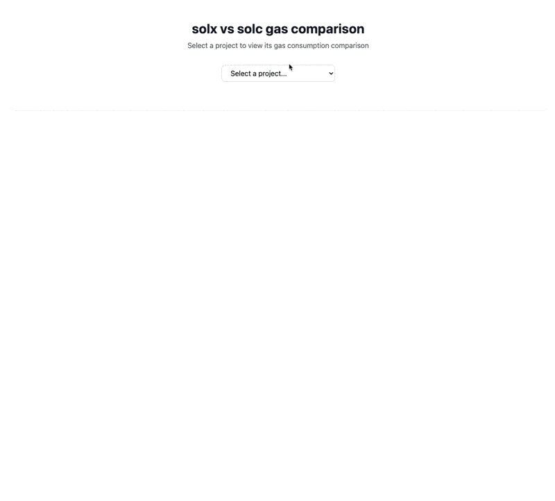

# 🧪 solx vs solc — Community Benchmark Suite

<p align="center">
  
</p>

This repo allows developers to **benchmark and compare** how [`solx`](https://github.com/matter-labs/solx) performs against `solc` in terms of **output, performance, and compatibility**. The repository contains a list of projects and a script to run the benchmarks against local projects that you might have.

---


## 📋 Requirements

- [Foundry](https://book.getfoundry.sh/getting-started/installation) for running the tests
- [Node.js](https://nodejs.org/) (v14 or later) for building the dashboard
- Git for cloning and contributing

---

## 🔍 Testing Local Projects

You can test any local Foundry project without adding it to this repository running the `compare.sh` script with the `-project` flag:

```bash
# Test a project in a different directory
./compare.sh -project ../my-other-project
```

Requirements for local projects:

- Must be a Foundry project (contains `foundry.toml`)
- Should have tests that use the gas report feature
- The solc version will be read from your `foundry.toml`

The results will appear [in the dashboard](#-running-the-dashboard-locally) under the project's directory name.

---


## Contribute with your own projects

> For detailed instructions on contributing new projects, managing dependencies, and running benchmarks, please see [CONTRIBUTING.md](CONTRIBUTING.md).

1. **Clone and set up:**
   ```bash
   git clone https://github.com/matter-labs/solx-solc-benchs
   cd solx-solc-benchs
   git submodule update --init --recursive
   ```

2. **Add your project:**
   ```bash
   # Create from template
   cp -r ./template-foundry-project my-contracts/
   
   # See CONTRIBUTING.md for detailed setup instructions
   ```

3. **Run benchmarks:**
   ```bash
   ./compare.sh my-contracts
   ```

4. **View results:**
   - Open `dashboard/index.html` in your browser
   - Select your project from the dropdown
   - Compare gas usage across different compiler configurations


## 🌐 Running the Dashboard Locally



1. **View the dashboard:**
   - Open `dashboard/index.html` in your browser

2. **Understanding the results:**
   - Select your project from the dropdown menu
   - Compare gas costs between solx and solc versions
   - View detailed method-by-method comparisons
   - Check deployment costs and optimizations

## 📢 Got Feedback?

[Join the conversation on Telegram](https://t.me/+75Mv1Nh6SKEzNTAy) if you find bugs, have questions, or want to help build out better tools.
